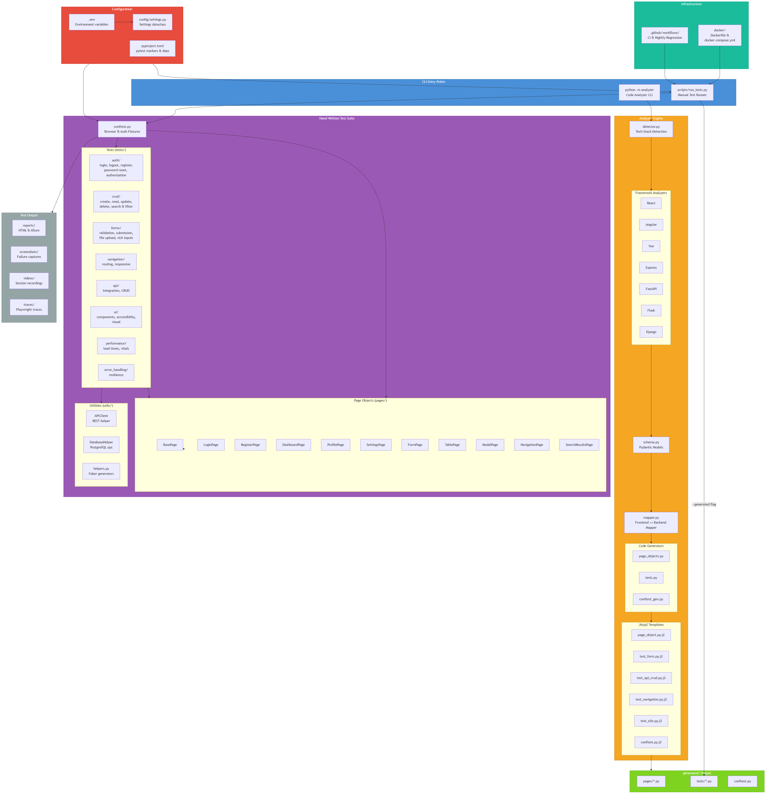
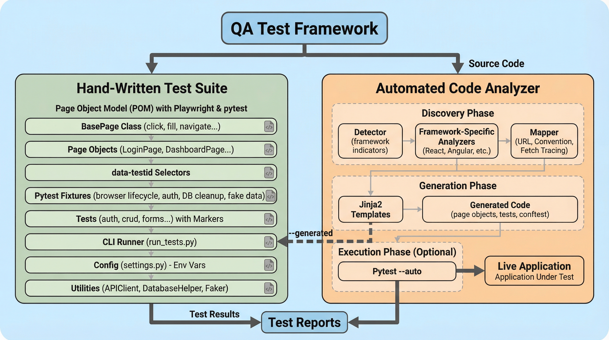
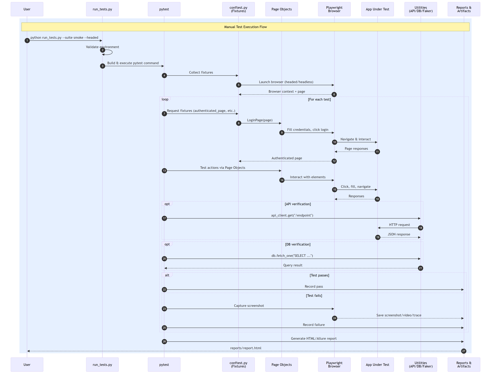
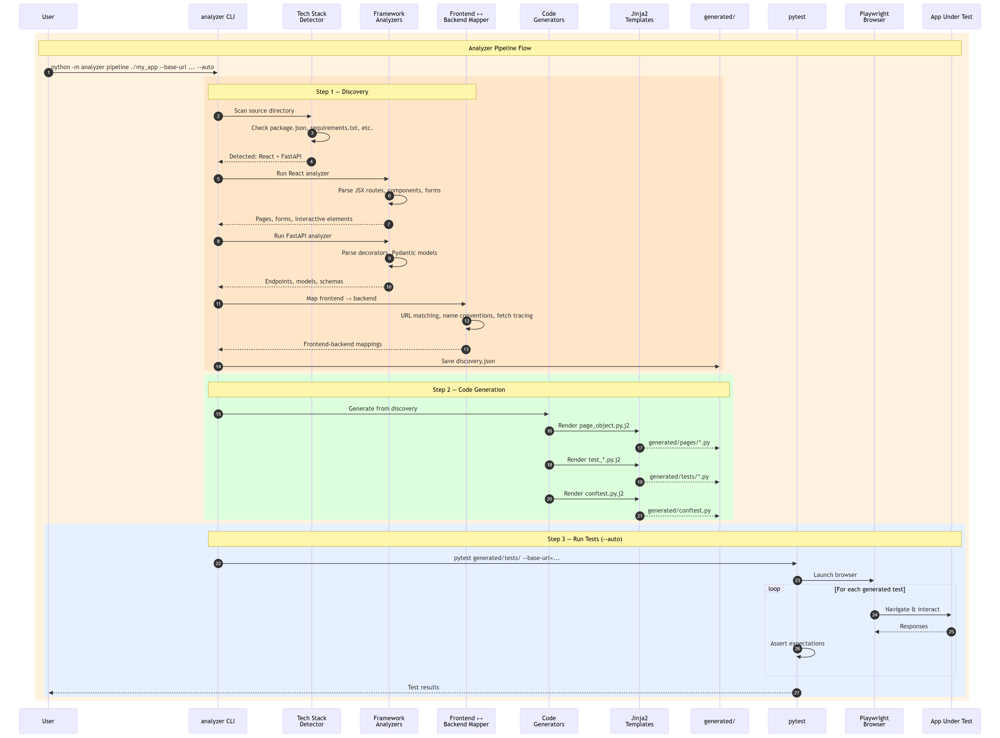

# QA Test Suite

A comprehensive, production-grade QA test suite built with **Playwright** and **pytest**. It uses the **Page Object Model** (POM) pattern and supports cross-browser testing, parallel execution, CI/CD integration, and rich reporting.

It also includes a **code analyzer engine** that can scan any web application's source code, detect its tech stack, and **auto-generate** page objects, fixtures, and test files.

---

## Table of Contents

- [Project Overview](#project-overview)
- [Architecture](#architecture)
- [Analyzer Pipeline](#analyzer-pipeline)
- [Directory Structure](#directory-structure)
- [Prerequisites](#prerequisites)
- [Installation](#installation)
- [Configuration](#configuration)
- [Running Tests](#running-tests)
  - [Using the CLI Runner](#using-the-cli-runner)
  - [Using pytest Directly](#using-pytest-directly)
  - [Running Specific Test Suites](#running-specific-test-suites)
  - [Cross-Browser Testing](#cross-browser-testing)
  - [Parallel Execution](#parallel-execution)
- [Using the Analyzer](#using-the-analyzer)
  - [Full Pipeline](#full-pipeline)
  - [Step-by-Step](#step-by-step)
  - [Supported Frameworks](#supported-frameworks)
  - [Combining Generated and Hand-Written Tests](#combining-generated-and-hand-written-tests)
- [CLI Options Reference](#cli-options-reference)
- [Writing New Tests](#writing-new-tests)
  - [Test File Structure](#test-file-structure)
  - [Using Page Objects](#using-page-objects)
  - [Available Fixtures](#available-fixtures)
  - [Using Markers](#using-markers)
- [Page Object Model](#page-object-model)
  - [BasePage Methods](#basepage-methods)
  - [Creating a New Page Object](#creating-a-new-page-object)
- [Reports and Artifacts](#reports-and-artifacts)
- [CI/CD Integration](#cicd-integration)
  - [GitHub Actions](#github-actions)
  - [Nightly Regression](#nightly-regression)
- [Docker Usage](#docker-usage)
- [Utilities](#utilities)
- [Troubleshooting](#troubleshooting)
- [Contributing](#contributing)

---

## Project Overview

This project has two complementary systems:

### 1. Hand-Written Test Suite

A manually authored E2E test suite for web applications covering:

- **Authentication & authorization** (login, registration, roles, sessions, password reset)
- **Form interaction & validation** (inputs, dropdowns, file uploads, client/server validation)
- **CRUD operations** (create, read, update, delete with data verification)
- **Navigation & UI components** (routing, menus, modals, responsive design)
- **API integration** (REST endpoint verification alongside UI tests)
- **Performance** (page load times, Core Web Vitals)
- **Accessibility** (ARIA compliance, keyboard navigation)
- **Error handling** (resilience and edge cases)

### 2. Code Analyzer Engine

A source code analysis tool that can automatically:

- **Detect the tech stack** of any web application (React, Vue, Angular, FastAPI, Flask, Django, Express)
- **Discover pages, routes, forms, API endpoints, and data models** from source code
- **Map frontend components to backend endpoints** using URL matching, naming conventions, and fetch/axios call tracing
- **Generate Playwright test code** including page objects, conftest fixtures, and test files from Jinja2 templates

All tests run against **Chromium**, **Firefox**, and **WebKit** via Playwright.

---

## Architecture



- **CLI Entry Points** — two ways to run: `scripts/run_tests.py` for hand-written tests, `python -m analyzer` for the code analyzer
- **Page Objects** encapsulate page-specific selectors and actions, inheriting from `BasePage`
- **Fixtures** in `conftest.py` handle browser setup, authentication, and cleanup
- **Markers** categorize tests into suites (smoke, regression, auth, crud, etc.)
- **Utilities** provide API, database, and data generation helpers
- **Analyzer Engine** detects frameworks, analyzes source code, maps frontend to backend, and generates test code via Jinja2 templates
- **Generated output** lands in `generated/` and can be run standalone or alongside the hand-written suite

### Test Execution Workflow





---

## Analyzer Pipeline

The analyzer runs a three-step pipeline: **Discover** → **Generate** → **Run**.



| Step | What It Does |
|---|---|
| **Discovery** | Scans source code, detects tech stack, parses routes/components/endpoints/models/forms, maps frontend to backend |
| **Generation** | Renders Jinja2 templates into page objects, test files, and conftest fixtures in `generated/` |
| **Run** (optional) | Executes the generated tests with pytest + Playwright against the running application |

---

## Directory Structure

```
QA_test_suite/
|-- analyzer/                     # Code analyzer engine
|   |-- cli.py                    # CLI entry point (discover, generate, run, pipeline)
|   |-- detector.py               # Tech stack detection
|   |-- mapper.py                 # Frontend-to-backend mapping (URL, convention, fetch tracing)
|   |-- schema.py                 # Pydantic models (pages, endpoints, forms, models, mappings)
|   |-- analyzers/                # Framework-specific analyzers
|   |   |-- base.py               # BaseAnalyzer abstract class
|   |   |-- registry.py           # Analyzer auto-registration
|   |   |-- react.py              # React/JSX analyzer
|   |   |-- angular.py            # Angular analyzer
|   |   |-- vue.py                # Vue analyzer
|   |   |-- express.py            # Express.js analyzer
|   |   |-- fastapi.py            # FastAPI analyzer
|   |   |-- flask.py              # Flask analyzer
|   |   +-- django.py             # Django analyzer
|   |-- generators/               # Code generation from discovery data
|   |   |-- page_objects.py       # Page object generator
|   |   |-- tests.py              # Test file generator
|   |   |-- conftest_gen.py       # Conftest fixture generator
|   |   +-- templates/            # Jinja2 templates
|   |       |-- page_object.py.j2
|   |       |-- test_form.py.j2
|   |       |-- test_api_crud.py.j2
|   |       |-- test_navigation.py.j2
|   |       |-- test_e2e.py.j2
|   |       |-- test_page_render.py.j2
|   |       +-- conftest.py.j2
|   +-- runners/                  # Pipeline orchestration
|       |-- discovery.py          # Discovery runner
|       |-- generation.py         # Generation runner
|       +-- pipeline.py           # Full pipeline (discover + generate + run)
|
|-- config/
|   |-- __init__.py
|   +-- settings.py               # Centralized settings (env vars, paths, timeouts)
|
|-- pages/
|   |-- __init__.py               # Exports all page objects
|   |-- base_page.py              # BasePage with common methods
|   |-- login_page.py             # LoginPage
|   |-- register_page.py          # RegisterPage
|   |-- dashboard_page.py         # DashboardPage
|   |-- profile_page.py           # ProfilePage
|   |-- settings_page.py          # SettingsPage
|   |-- form_page.py              # FormPage
|   |-- table_page.py             # TablePage
|   |-- modal_page.py             # ModalPage
|   |-- navigation_page.py        # NavigationPage
|   +-- search_results_page.py    # SearchResultsPage
|
|-- tests/
|   |-- conftest.py               # Test-level fixtures (fake_user, unique_email)
|   |-- auth/                     # Authentication tests
|   |   |-- test_login.py
|   |   |-- test_logout.py
|   |   |-- test_registration.py
|   |   |-- test_password_reset.py
|   |   +-- test_authorization.py
|   |-- crud/                     # CRUD operation tests
|   |   |-- test_create.py
|   |   |-- test_read.py
|   |   |-- test_update.py
|   |   |-- test_delete.py
|   |   +-- test_search_filter.py
|   |-- forms/                    # Form interaction tests
|   |   |-- test_form_validation.py
|   |   |-- test_form_submission.py
|   |   |-- test_file_upload.py
|   |   +-- test_rich_inputs.py
|   |-- navigation/               # Navigation tests
|   |   |-- test_navigation.py
|   |   +-- test_responsive.py
|   |-- api/                      # API integration tests
|   |   |-- test_api_integration.py
|   |   +-- test_api_crud.py
|   |-- ui/                       # UI component tests
|   |   |-- test_components.py
|   |   |-- test_accessibility.py
|   |   +-- test_visual.py
|   |-- performance/              # Performance tests
|   |   +-- test_performance.py
|   +-- error_handling/           # Error handling tests
|       +-- test_error_handling.py
|
|-- utils/
|   |-- __init__.py
|   |-- api_client.py             # REST API client wrapper
|   |-- database.py               # Database helper (PostgreSQL)
|   +-- helpers.py                # Faker generators, utilities
|
|-- scripts/
|   |-- run_tests.py              # CLI test runner
|   +-- setup.py                  # Environment setup script
|
|-- docker/
|   |-- Dockerfile                # Docker image for test execution
|   +-- docker-compose.yml        # Docker Compose services
|
|-- .github/workflows/
|   |-- qa-tests.yml              # CI pipeline (push, PR, manual)
|   +-- nightly-regression.yml    # Nightly full regression
|
|-- generated/                    # Auto-generated code (created by analyzer, gitignored)
|   |-- discovery.json            # Discovery results
|   |-- pages/*.py                # Generated page objects
|   |-- tests/*.py                # Generated test files
|   +-- conftest.py               # Generated conftest
|
|-- reports/                      # Generated test reports (gitignored)
|-- screenshots/                  # Failure screenshots (gitignored)
|-- videos/                       # Video recordings (gitignored)
|-- traces/                       # Playwright traces (gitignored)
|
|-- conftest.py                   # Root conftest (browser, auth, hooks)
|-- pyproject.toml                # Project config, dependencies, pytest settings
|-- .env.example                  # Example environment configuration
|-- CLAUDE.md                     # AI assistant project guide
+-- README.md                     # This file
```

---

## Prerequisites

- **Python 3.10+** (3.11 recommended)
- **[uv](https://docs.astral.sh/uv/)** - Fast Python package manager
- **Node.js** (optional, required only if Playwright needs to download browsers with system deps)
- **Git**

---

## Installation

### Quick Setup (recommended)

```bash
# Clone the repository
git clone <repository-url>
cd QA_test_suite

# Run the automated setup
python scripts/setup.py
```

The setup script will:
1. Install Python dependencies from `pyproject.toml`
2. Install Playwright browsers (Chromium, Firefox, WebKit)
3. Create a `.env` file from `.env.example` if missing
4. Verify the environment is ready

### Manual Setup

```bash
# Install dependencies
uv sync

# Install dev dependencies (ruff, mypy)
uv sync --extra dev

# Install Playwright browsers with system dependencies
uv run python -m playwright install --with-deps

# Copy and configure environment
cp .env.example .env
# Edit .env with your settings
```

### Install Specific Browsers Only

```bash
# Install only Chromium
python scripts/setup.py --browsers chromium

# Skip browser installation entirely
python scripts/setup.py --skip-browsers
```

---

## Configuration

All configuration is managed through environment variables. Copy `.env.example` to `.env` and customize:

| Variable | Default | Description |
|---|---|---|
| `BASE_URL` | `http://localhost:3000` | Application base URL |
| `API_URL` | `http://localhost:3000/api` | API base URL |
| `ADMIN_USER` | `admin@example.com` | Admin account email |
| `ADMIN_PASS` | `admin123` | Admin account password |
| `TEST_USER` | `user@example.com` | Standard test user email |
| `TEST_PASS` | `user123` | Standard test user password |
| `DB_CONNECTION` | `postgresql://...` | Database connection string |
| `HEADLESS` | `true` | Run browsers in headless mode |
| `SLOW_MO` | `0` | Slow down actions by N ms (debugging) |
| `DEFAULT_TIMEOUT` | `10000` | Default element timeout (ms) |
| `NAVIGATION_TIMEOUT` | `30000` | Page navigation timeout (ms) |
| `VIEWPORT_WIDTH` | `1280` | Browser viewport width |
| `VIEWPORT_HEIGHT` | `720` | Browser viewport height |
| `SCREENSHOT_ON_FAILURE` | `true` | Capture screenshot on test failure |
| `VIDEO_RECORDING` | `off` | Record video (`on`/`off`) |
| `TRACE_RECORDING` | `off` | Record Playwright traces (`on`/`off`) |

---

## Running Tests

### Using the CLI Runner

The `scripts/run_tests.py` script provides a convenient CLI for running the hand-written test suite:

```bash
# Run smoke tests with Chromium (default)
python scripts/run_tests.py

# Run smoke tests in headed mode (see the browser)
python scripts/run_tests.py --suite smoke --browser chromium --headed

# Run regression tests with Firefox
python scripts/run_tests.py --suite regression --browser firefox

# Run full suite across all browsers
python scripts/run_tests.py --suite full --browser all

# Run with parallel workers
python scripts/run_tests.py --suite regression --workers 4

# Override base URL for staging
python scripts/run_tests.py --suite smoke --base-url https://staging.example.com

# Enable tracing and video on failure
python scripts/run_tests.py --suite smoke --tracing --video

# Run with Allure reporting
python scripts/run_tests.py --suite regression --report allure

# Filter tests by keyword
python scripts/run_tests.py --suite full -k "login or register"

# Include auto-generated tests alongside hand-written ones
python scripts/run_tests.py --suite smoke --generated
```

### Using pytest Directly

```bash
# Basic run
python -m pytest tests/ -v

# Run with a specific marker
python -m pytest tests/ -m smoke --browser chromium -v

# Run a specific test file
python -m pytest tests/auth/test_login.py -v

# Run a specific test class
python -m pytest tests/auth/test_login.py::TestLogin -v

# Run a specific test method
python -m pytest tests/auth/test_login.py::TestLogin::test_valid_login -v

# Run with keyword expression
python -m pytest tests/ -k "login and not social" -v

# Run in parallel (4 workers)
python -m pytest tests/ -n 4 -v
```

### Running Specific Test Suites

```bash
# Smoke tests (quick, critical paths only)
python -m pytest tests/ -m smoke -v

# Regression tests (comprehensive)
python -m pytest tests/ -m regression -v

# Critical business functionality
python -m pytest tests/ -m critical -v

# Feature-specific suites
python -m pytest tests/ -m auth -v            # Authentication tests
python -m pytest tests/ -m forms -v           # Form tests
python -m pytest tests/ -m crud -v            # CRUD tests
python -m pytest tests/ -m navigation -v      # Navigation tests
python -m pytest tests/ -m api -v             # API tests
python -m pytest tests/ -m performance -v     # Performance tests
python -m pytest tests/ -m ui -v              # UI component tests
python -m pytest tests/ -m error_handling -v  # Error handling tests
```

### Cross-Browser Testing

```bash
# Single browser
python -m pytest tests/ --browser chromium -v
python -m pytest tests/ --browser firefox -v
python -m pytest tests/ --browser webkit -v

# Multiple browsers in one run
python -m pytest tests/ --browser chromium --browser firefox --browser webkit -v
```

### Parallel Execution

```bash
# Run with 4 parallel workers
python -m pytest tests/ -n 4 -v

# Auto-detect CPU count
python -m pytest tests/ -n auto -v
```

---

## Using the Analyzer

The analyzer scans your application's source code and generates Playwright tests automatically. It is invoked via `python -m analyzer`.

### Full Pipeline

Run discovery, generation, and test execution in one command:

```bash
# Analyze a React + FastAPI app and auto-run the generated tests
python -m analyzer pipeline ./path/to/your/app \
    --base-url http://localhost:5173 \
    --api-url http://localhost:8000 \
    --auto --headed

# Same but headless (CI-friendly)
python -m analyzer pipeline ./path/to/your/app \
    --base-url http://localhost:3000 \
    --auto

# Generate tests without running them
python -m analyzer pipeline ./path/to/your/app \
    --base-url http://localhost:3000
```

### Step-by-Step

You can also run each step individually:

```bash
# Step 1: Discover — scan source code and produce discovery.json
python -m analyzer discover ./path/to/your/app -o generated/discovery.json

# Step 2: Generate — create page objects, tests, and conftest from discovery
python -m analyzer generate --schema generated/discovery.json --output-dir generated

# Step 3: Run — execute the generated tests
python -m analyzer run --base-url http://localhost:3000 --api-url http://localhost:8000
```

### Supported Frameworks

| Frontend | Backend |
|---|---|
| React (JSX/TSX routes, components, forms) | FastAPI (decorators, Pydantic models) |
| Angular (modules, routing, templates) | Flask (route decorators, models) |
| Vue (SFC routes, components, templates) | Django (URL conf, views, ORM models) |
| | Express.js (router, middleware) |

The analyzer detects frameworks by inspecting `package.json`, `requirements.txt`, `pyproject.toml`, project structure, and import patterns. Multiple frameworks can be detected simultaneously (e.g., React frontend + FastAPI backend).

### Frontend-to-Backend Mapping

The mapper uses three strategies to link frontend forms/pages to backend API endpoints:

1. **URL path matching** — matches form `action_url` directly against endpoint paths (highest confidence)
2. **Name/convention matching** — matches page/form names against endpoint names using CRUD verb conventions
3. **Fetch/axios reference tracing** — scans source files for `fetch()`, `axios.*()`, and `$.ajax()` calls to find API references

### Combining Generated and Hand-Written Tests

```bash
# Run hand-written tests + generated tests together
python scripts/run_tests.py --suite smoke --generated

# Or with pytest directly
python -m pytest tests/ generated/tests/ -v
```

---

## CLI Options Reference

### `scripts/run_tests.py`

| Option | Values | Default | Description |
|---|---|---|---|
| `--suite` | smoke, regression, full, auth, forms, crud, navigation, api, performance, accessibility, critical | smoke | Test suite to run |
| `--browser` | chromium, firefox, webkit, all | chromium | Browser to use |
| `--headed` | flag | false | Show browser window |
| `--workers` | integer | 1 | Parallel worker count |
| `--base-url` | URL string | from .env | Override base URL |
| `--report` | html, allure, both | html | Report format |
| `--timeout` | seconds | 30 | Test timeout |
| `--retries` | integer | 0 | Retry count for flaky tests |
| `--tracing` | flag | false | Enable Playwright tracing |
| `--video` | flag | false | Enable video recording |
| `--generated` | flag | false | Include generated tests from `generated/tests/` |
| `-v` | flag | false | Verbose output |
| `-k` | expression | none | pytest keyword filter |

### `python -m analyzer`

| Subcommand | Description |
|---|---|
| `discover <source_dir>` | Scan source code, output `discovery.json` |
| `generate --schema <path>` | Generate test code from discovery data |
| `run --base-url <url>` | Run previously generated tests |
| `pipeline <source_dir>` | Full pipeline: discover + generate + optionally run |

**Pipeline options:**

| Option | Default | Description |
|---|---|---|
| `--base-url` | `http://localhost:3000` | Frontend URL for browser tests |
| `--api-url` | same as base-url | Backend API URL (for apps with separate frontend/backend) |
| `--output-dir` | `generated` | Output directory for generated code |
| `--browser` | chromium | Browser to use (chromium, firefox, webkit) |
| `--headed` | false | Run browser in visible mode |
| `--auto` | false | Automatically run tests after generation |

---

## Writing New Tests

### Test File Structure

Create test files in `tests/<feature>/` following the naming convention `test_<behavior>.py`:

```python
"""Tests for the user profile feature."""

from __future__ import annotations

import pytest
from playwright.sync_api import Page, expect

from pages import ProfilePage


@pytest.mark.smoke
@pytest.mark.regression
class TestProfileDisplay:
    """Tests for viewing user profile information."""

    def test_profile_shows_username(self, authenticated_page: Page) -> None:
        """Verify the profile page displays the logged-in username."""
        profile = ProfilePage(authenticated_page)
        profile.navigate_to_profile()
        expect(profile.locator(ProfilePage.USERNAME_DISPLAY)).to_be_visible()

    def test_profile_shows_email(self, authenticated_page: Page) -> None:
        """Verify the profile page displays the user email."""
        profile = ProfilePage(authenticated_page)
        profile.navigate_to_profile()
        expect(profile.locator(ProfilePage.EMAIL_DISPLAY)).to_be_visible()


@pytest.mark.regression
class TestProfileEdit:
    """Tests for editing user profile."""

    def test_update_display_name(self, authenticated_page: Page, fake_user: dict) -> None:
        """Verify the user can update their display name."""
        profile = ProfilePage(authenticated_page)
        profile.navigate_to_profile()
        profile.update_display_name(fake_user["first_name"])
        expect(profile.locator(ProfilePage.SUCCESS_MESSAGE)).to_be_visible()
```

### Using Page Objects

Page objects encapsulate page-specific selectors and actions:

```python
from pages import LoginPage, DashboardPage

def test_login_flow(page: Page) -> None:
    login = LoginPage(page)
    login.navigate_to_login()
    login.login("user@example.com", "password")

    dashboard = DashboardPage(page)
    assert dashboard.is_dashboard_loaded()
```

### Available Fixtures

| Fixture | Scope | Description |
|---|---|---|
| `page` | function | Fresh Playwright page with tracing support |
| `authenticated_page` | function | Page logged in as standard test user |
| `admin_page` | function | Page logged in as admin user |
| `guest_page` | function | Page with no authentication |
| `api_client` | session | REST API client instance |
| `db_cleanup` | function | Database helper with auto-disconnect |
| `fake_user` | function | Dict of random user data (Faker) |
| `unique_email` | function | Random email for test isolation |
| `sample_text` | function | Random paragraph text |

### Using Markers

Apply markers to categorize tests for suite selection:

```python
@pytest.mark.smoke           # Quick critical path tests
@pytest.mark.regression      # Full regression coverage
@pytest.mark.critical        # Critical business features
@pytest.mark.auth            # Authentication tests
@pytest.mark.forms           # Form interaction tests
@pytest.mark.crud            # CRUD operation tests
@pytest.mark.navigation      # Navigation tests
@pytest.mark.api             # API integration tests
@pytest.mark.performance     # Performance tests
@pytest.mark.accessibility   # Accessibility tests
@pytest.mark.ui              # UI component tests
@pytest.mark.error_handling  # Error handling tests
@pytest.mark.e2e             # End-to-end tests
@pytest.mark.generated       # Auto-generated tests
@pytest.mark.slow            # Long-running tests
```

Multiple markers can be combined:

```python
@pytest.mark.smoke
@pytest.mark.auth
@pytest.mark.critical
def test_login_with_valid_credentials(self, page: Page) -> None:
    ...
```

---

## Page Object Model

### BasePage Methods

All page objects inherit from `BasePage`, which provides:

| Category | Method | Description |
|---|---|---|
| **Navigation** | `navigate(path)` | Go to a URL path relative to base URL |
| | `wait_for_load()` | Wait for network idle |
| | `get_title()` | Get page title |
| | `get_current_url()` | Get current URL |
| **Interaction** | `click(selector)` | Click an element |
| | `fill(selector, value)` | Clear and fill an input |
| | `select_option(selector, ...)` | Select from a dropdown |
| | `check(selector)` | Check a checkbox |
| | `uncheck(selector)` | Uncheck a checkbox |
| | `type_text(selector, text)` | Type character by character |
| | `hover(selector)` | Hover over an element |
| **State** | `is_visible(selector)` | Check element visibility |
| | `is_enabled(selector)` | Check if element is enabled |
| | `is_checked(selector)` | Check if checkbox is checked |
| | `get_text(selector)` | Get inner text |
| | `get_input_value(selector)` | Get input value |
| | `get_attribute(selector, attr)` | Get attribute value |
| | `get_element_count(selector)` | Count matching elements |
| **Waiting** | `wait_for_selector(selector)` | Wait for element state |
| | `wait_for_navigation(url)` | Wait for URL change |
| | `wait_for_hidden(selector)` | Wait for element to hide |
| **Locators** | `locator(selector)` | Get a Playwright Locator |
| | `get_by_test_id(id)` | Get by `data-testid` |
| | `get_by_role(role)` | Get by ARIA role |
| | `get_by_text(text)` | Get by text content |

### Creating a New Page Object

```python
from __future__ import annotations

from playwright.sync_api import Page

from pages.base_page import BasePage


class ProductPage(BasePage):
    """Page Object for the Product detail page."""

    # Selectors (use data-testid)
    PRODUCT_TITLE = '[data-testid="product-title"]'
    PRODUCT_PRICE = '[data-testid="product-price"]'
    ADD_TO_CART = '[data-testid="add-to-cart-button"]'
    QUANTITY_INPUT = '[data-testid="quantity-input"]'

    def __init__(self, page: Page) -> None:
        super().__init__(page)
        self.path = "/products"

    def navigate_to_product(self, product_id: str) -> None:
        self.navigate(f"{self.path}/{product_id}")

    def get_product_title(self) -> str:
        return self.get_text(self.PRODUCT_TITLE)

    def get_product_price(self) -> str:
        return self.get_text(self.PRODUCT_PRICE)

    def add_to_cart(self, quantity: int = 1) -> None:
        self.fill(self.QUANTITY_INPUT, str(quantity))
        self.click(self.ADD_TO_CART)
```

Then register it in `pages/__init__.py`.

---

## Reports and Artifacts

### HTML Reports

After a test run, an HTML report is generated at `reports/report.html`. Open it in any browser:

```bash
# macOS
open reports/report.html

# Linux
xdg-open reports/report.html

# Windows
start reports/report.html
```

### Allure Reports

To use Allure reporting:

```bash
# Run tests with Allure
python scripts/run_tests.py --report allure

# Generate and open Allure report (requires allure CLI)
allure serve reports/allure-results
```

### Screenshots

Failure screenshots are saved automatically to `screenshots/FAIL_<test_name>.png` when `SCREENSHOT_ON_FAILURE=true`.

### Videos

When `VIDEO_RECORDING=on`, browser session videos are saved to `videos/`.

### Traces

When `TRACE_RECORDING=on`, Playwright traces are saved to `traces/` on failure. View traces with:

```bash
python -m playwright show-trace traces/FAIL_test_name.zip
```

---

## CI/CD Integration

### GitHub Actions

Two workflow files are included:

**`qa-tests.yml`** - Main CI pipeline:

| Trigger | Behavior |
|---|---|
| Push to `main`/`develop` | Run smoke tests (Chromium), then full regression on `main` (all browsers) |
| Pull Request | Run smoke tests (Chromium) |
| Manual dispatch | Choose suite, browser, and base URL |

**Features:**
- uv dependency caching
- Playwright browser caching
- Test report artifact uploads
- Screenshot and trace uploads on failure
- Video uploads for regression runs
- Browser matrix strategy (Chromium, Firefox, WebKit)

### Nightly Regression

**`nightly-regression.yml`** runs the full test suite every night at 2:00 AM UTC across all browsers with:
- Automatic retries (2 per failed test)
- Video and trace recording enabled
- Summary reporting
- Configurable Slack notifications (uncomment in workflow)

### Manual Dispatch

Trigger a run from the GitHub Actions UI:

1. Go to **Actions** > **QA Tests**
2. Click **Run workflow**
3. Select suite, browser, and optionally override the base URL

---

## Docker Usage

### Build the Image

```bash
docker build -f docker/Dockerfile -t qa-test-suite .
```

### Run Tests with Docker

```bash
# Run smoke tests (default)
docker run --rm -v $(pwd)/reports:/app/reports qa-test-suite

# Run regression tests
docker run --rm -v $(pwd)/reports:/app/reports qa-test-suite \
  tests/ -m regression --browser chromium -v

# Run with a custom base URL
docker run --rm -e BASE_URL=https://staging.example.com \
  -v $(pwd)/reports:/app/reports qa-test-suite
```

### Docker Compose

The `docker/docker-compose.yml` provides pre-configured services:

```bash
# Run smoke tests
docker compose -f docker/docker-compose.yml up smoke

# Run regression tests
docker compose -f docker/docker-compose.yml up regression

# Run all browsers
docker compose -f docker/docker-compose.yml up all-browsers

# Override base URL
BASE_URL=https://staging.example.com docker compose -f docker/docker-compose.yml up smoke
```

Reports, screenshots, videos, and traces are mounted to the host automatically.

---

## Utilities

### API Client

Use `APIClient` for backend verification alongside UI tests:

```python
def test_user_creation_reflected_in_api(
    self, authenticated_page: Page, api_client: APIClient
) -> None:
    # ... create user via UI ...
    response = api_client.get("/users?email=new@example.com")
    api_client.assert_status(response, 200)
```

### Database Helper

Use `DatabaseHelper` for direct DB verification (requires `psycopg2-binary`):

```python
def test_data_persisted_to_db(self, page: Page, db_cleanup) -> None:
    # ... perform action via UI ...
    result = db_cleanup.fetch_one(
        "SELECT * FROM users WHERE email = %s",
        ("new@example.com",),
    )
    assert result is not None
```

### Fake Data Generators

```python
from utils.helpers import generate_fake_user, random_email, random_string

user = generate_fake_user()  # Dict with first_name, last_name, email, ...
email = random_email()        # Random test email
text = random_string(20)      # Random alphanumeric string
```

---

## Troubleshooting

### Playwright browsers not installed

```
Error: Executable doesn't exist at ...
```

**Fix:** Install browsers with system dependencies:
```bash
python -m playwright install --with-deps
```

### Tests timeout immediately

**Likely cause:** The application under test is not running at `BASE_URL`.

**Fix:** Start the application, then verify:
```bash
curl http://localhost:3000
```

Or override the URL:
```bash
python scripts/run_tests.py --base-url https://your-app-url.com
```

### Permission denied on Linux/CI

```
Error: Failed to launch browser
```

**Fix:** Install system dependencies:
```bash
python -m playwright install-deps
```

### Tests pass locally but fail in CI

- Ensure `HEADLESS=true` in CI
- Check that the base URL is accessible from the CI runner
- Increase timeouts for CI: `--timeout 60`
- Review screenshots and traces in the CI artifacts

### Import errors

```
ModuleNotFoundError: No module named 'pages'
```

**Fix:** Sync the project dependencies:
```bash
uv sync
```

### Video/trace files not generated

Ensure the environment variables are set:
```bash
export VIDEO_RECORDING=on
export TRACE_RECORDING=on
```

Or use CLI flags:
```bash
python scripts/run_tests.py --video --tracing
```

### Analyzer detects no frameworks

- Ensure you're pointing to the correct source directory (the one containing `package.json` or `requirements.txt`)
- Check that the source code uses one of the supported frameworks
- Try lowering the detection threshold (default is 30% confidence)

---

## Contributing

1. **Branch naming:** `feature/<name>`, `fix/<name>`, `test/<name>`
2. **Test naming:** `test_<behavior>.py` files, `Test<Feature>` classes, `test_<behavior>` methods
3. **Test organization:** Place tests in the appropriate `tests/<feature>/` subdirectory
4. **Markers:** Always apply at least `@pytest.mark.smoke` or `@pytest.mark.regression`
5. **Page Objects:** Create page objects for new pages; never put selectors directly in tests
6. **Selectors:** Use `data-testid` attributes exclusively
7. **Settings:** Use `from config.settings import settings`; never hardcode URLs or credentials
8. **Linting:** Run `ruff check .` before committing
9. **Type checking:** Run `mypy .` to verify type annotations

---

*Built with [Playwright](https://playwright.dev/python/) and [pytest](https://docs.pytest.org/).*
